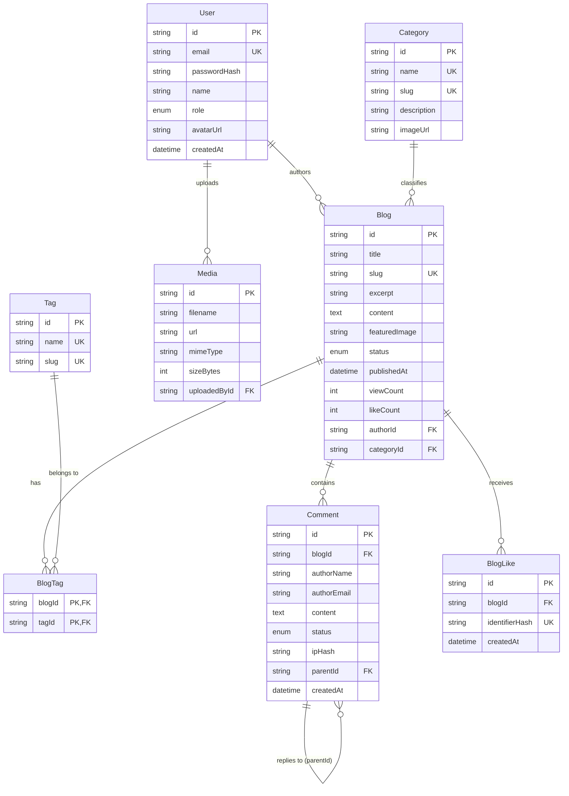
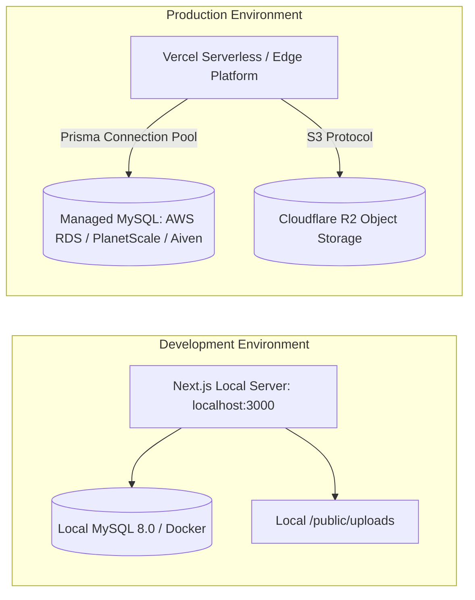

# Technical Architecture Document
## MOTORIST Blog + Content Management System (CMS)

---

### Document Control
- **Document Version:** 1.1.0
- **Status:** Approved / Phase 1 Complete
- **Product Name:** MOTORIST Blog + CMS
- **Approved Technology Stack:** Next.js (App Router), TypeScript, Tailwind CSS, MySQL, Prisma ORM
- **Lead Architect:** Antigravity AI (Lead Product Architect & Senior Software Engineer)

---

## 1. System Overview

The MOTORIST Blog + CMS is engineered as a unified, high-performance, full-stack Next.js application leveraging the **App Router**, **React Server Components (RSC)**, **Server Actions**, **TypeScript**, and **Prisma ORM** backed by a **MySQL** relational database.

By utilizing Next.js's hybrid rendering capabilities (Static Site Generation with On-Demand Incremental Static Regeneration `ISR`, Dynamic Server Rendering, and streaming Server Components), the architecture guarantees near-instant Time to First Byte (TTFB), optimal Google Core Web Vitals, zero client-side JavaScript overhead for static prose, and a secure internal API boundary for content management.

### Architectural Decision: Unified Next.js vs. Separate Node.js Backend
A separate Node.js / Express / NestJS backend was evaluated and **rejected** for the following architectural reasons:
1. **Unnecessary Operational Overhead:** A separate microservice introduces dual CI/CD pipelines, CORS management, multi-domain cookie issues, and duplicated TypeScript types.
2. **Next.js App Router Native Strengths:** Route Handlers (`app/api/...`) and Server Actions provide full Node.js runtime capabilities, direct Prisma database connectivity, streaming, and connection pooling without latency penalties.
3. **Cache Revalidation Synchronization:** Publishing in CMS requires instant cache invalidation via `revalidatePath()` and `revalidateTag()`, which is native and synchronous within the unified Next.js architecture.

---

## 2. High-Level Architecture Diagram

```mermaid
graph TD
    subgraph Client Tier
        BrowserUser[Public Reader / Mobile & Desktop]
        BrowserAdmin[Editorial Admin / Desktop]
    end

    subgraph Edge & Routing Tier
        CDN[Edge CDN / Vercel / Cloudflare]
        Middleware[Next.js Middleware: Auth & Rate Limiting]
    end

    subgraph Next.js Fullstack Tier
        subgraph App Router
            PublicPages[Public Server Components (RSC)]
            AdminPages[Admin CMS Pages (RSC + Client Components)]
            ServerActions[Next.js Server Actions (Mutations)]
            RouteHandlers[REST API Route Handlers /api/v1/...]
        end
        
        subgraph Services Tier
            AuthService[Auth Service (JWT / Argon2id)]
            SanitizationService[Sanitization Service (DOMPurify)]
            UploadService[Upload Service: Local / Cloudflare R2 Abstraction]
            SearchService[MySQL Full-Text Search Engine]
        end

        PrismaClient[Prisma ORM Client]
    end

    subgraph Data & Storage Tier
        MySQL[(MySQL 8.0+ Relational DB)]
        MediaStorage[(Object Storage: Cloudflare R2 / Local Disk)]
        CacheStorage[(Redis / In-Memory Cache for Rate Limiting)]
    end

    BrowserUser -->|HTTPS GET /blog, /| CDN
    BrowserAdmin -->|HTTPS GET/POST /admin| CDN
    CDN --> Middleware
    Middleware --> PublicPages
    Middleware --> AdminPages
    BrowserUser -->|Server Action: Like, Comment| ServerActions
    BrowserAdmin -->|Server Action: CRUD Blog| ServerActions
    BrowserAdmin -->|POST /api/v1/media| RouteHandlers
    
    PublicPages --> PrismaClient
    AdminPages --> PrismaClient
    ServerActions --> SanitizationService
    ServerActions --> PrismaClient
    RouteHandlers --> UploadService
    UploadService --> MediaStorage
    PrismaClient --> MySQL
    Middleware --> CacheStorage
```

---

## 3. Frontend Architecture

### 3.1 App Router Directory Structure
The application structure strictly separates public-facing editorial routes from authenticated administrative management routes using Next.js Route Groups `(public)` and `(admin)`.

```
src/app/
├── (public)/                      # Public editorial route group (uses public layout)
│   ├── layout.tsx                 # Public header, navigation, footer, brand bar
│   ├── page.tsx                   # Blog Homepage (Hero, Latest, Categories)
│   ├── blog/
│   │   ├── page.tsx               # Blog archive / paginated directory
│   │   └── [slug]/
│   │       ├── page.tsx           # Individual post reading page (RSC)
│   │       ├── loading.tsx        # Skeleton reading layout
│   │       └── opengraph-image.tsx# Dynamic Edge Open Graph image generator
│   ├── category/
│   │   └── [slug]/page.tsx        # Category archive
│   ├── tag/
│   │   └── [slug]/page.tsx        # Tag archive
│   ├── search/
│   │   └── page.tsx               # Dedicated full-text search results page
│   └── author/
│       └── [slug]/page.tsx        # Author profile & posts
├── (admin)/                       # Authenticated CMS route group (uses admin layout)
│   ├── admin/
│   │   ├── layout.tsx             # Admin sidebar, header, breadcrumbs, auth check
│   │   ├── page.tsx               # Admin analytics dashboard
│   │   ├── login/page.tsx         # Admin login portal
│   │   ├── blogs/
│   │   │   ├── page.tsx           # Posts data table & filter tabs
│   │   │   ├── new/page.tsx       # Create new post canvas
│   │   │   └── [id]/page.tsx      # Edit post canvas
│   │   ├── categories/page.tsx    # Category manager
│   │   ├── tags/page.tsx          # Tag manager
│   │   ├── comments/page.tsx      # Comment moderation queue
│   │   ├── media/page.tsx         # Media library & file uploader
│   │   └── settings/page.tsx      # Global SEO & blog settings
├── api/                           # Route handlers for webhooks, cron, and REST access
│   ├── v1/
│   │   ├── search/route.ts        # Instant search API
│   │   ├── media/route.ts         # Media upload handler
│   │   └── cron/
│   │       └── publish/route.ts   # Scheduled publishing cron endpoint
│   └── auth/                      # NextAuth / Auth session endpoints
├── sitemap.ts                     # Dynamic XML sitemap generator
├── robots.ts                      # Dynamic robots.txt generator
├── globals.css                    # Tailwind CSS v3/v4 & custom brand utilities
└── layout.tsx                     # Root HTML shell, fonts (Jost, Open Sans)
```

### 3.2 Component Taxonomy
- **Server Components (Default):** All static layouts, article content renderers, category lists, metadata injections, and author displays.
- **Client Components (`"use client"`):** Strictly reserved for:
  - Like button (`<BlogLikeButton />`): Optimistic state, pulse animations, local storage syncing.
  - Comment submission form (`<CommentForm />`): Form state, validation feedback, Turnstile challenge, toast triggering.
  - Interactive search modal (`<SearchCommandDialog />`): `Cmd+K` keyboard shortcut, debounced query input.
  - Admin WYSIWYG / Markdown editor (`<MarkdownEditor />`): Splitting, toolbar, live preview.
  - Admin data tables (`<DataTable />`): Client-side pagination, sorting, row selection.
  - Mobile navigation drawer (`<MobileNav />`): Off-canvas sheet toggle.

---

## 4. Backend & API Architecture

### 4.1 Mutation Pattern: Server Actions vs. Route Handlers
1. **Server Actions (`src/actions/...`):** Primary mechanism for internal application mutations (`createBlogAction`, `toggleLikeAction`, `submitCommentAction`, `moderateCommentAction`). Benefits include direct database calls, type safety with Zod, and automatic revalidation.
2. **Route Handlers (`src/app/api/v1/...`):** Used strictly for:
   - External consumer APIs (headless consumption).
   - Binary file uploads (`multipart/form-data` to `/api/v1/media`).
   - Cron automation (`/api/v1/cron/publish`).

### 4.2 Standardized API Response Structure
All Route Handlers and Server Actions return a deterministic response schema:

```typescript
// Standard API Success Response
export type ApiResponse<T> = {
  success: true;
  data: T;
  meta?: {
    page?: number;
    limit?: number;
    total?: number;
  };
};

// Standard API Error Response
export type ApiErrorResponse = {
  success: false;
  error: {
    code: string;       // e.g. "VALIDATION_ERROR", "UNAUTHORIZED", "NOT_FOUND"
    message: string;    // Human-readable message
    details?: unknown;  // Field-specific validation errors from Zod
  };
};
```

---

## 5. Database Architecture & Prisma Schema Planning

### 5.1 Database Engine
- **Engine:** MySQL 8.0+
- **Collation:** `utf8mb4_unicode_ci` (full emoji, multilingual, automotive technical symbols support).
- **ORM:** Prisma ORM with connection pooling enabled.

### 5.2 Proposed Prisma Schema (`prisma/schema.prisma`)

```prisma
datasource db {
  provider = "mysql"
  url      = env("DATABASE_URL")
}

generator client {
  provider = "prisma-client-js"
}

enum Role {
  SUPER_ADMIN
  EDITOR
  AUTHOR
}

enum PostStatus {
  DRAFT
  SCHEDULED
  PUBLISHED
  ARCHIVED
}

enum CommentStatus {
  PENDING
  APPROVED
  SPAM
  REJECTED
}

model User {
  id           String    @id @default(cuid())
  email        String    @unique @db.VarChar(255)
  passwordHash String    @db.VarChar(255)
  name         String    @db.VarChar(120)
  role         Role      @default(EDITOR)
  avatarUrl    String?   @db.VarChar(512)
  bio          String?   @db.Text
  socialLinks  Json?     // { twitter: "", instagram: "", linkedin: "" }
  createdAt    DateTime  @default(now())
  updatedAt    DateTime  @updatedAt

  blogs        Blog[]
  mediaItems   Media[]

  @@map("users")
}

model Category {
  id          String   @id @default(cuid())
  name        String   @unique @db.VarChar(100)
  slug        String   @unique @db.VarChar(120)
  description String?  @db.VarChar(500)
  imageUrl    String?  @db.VarChar(512)
  order       Int      @default(0)
  createdAt   DateTime @default(now())
  updatedAt   DateTime @updatedAt

  blogs       Blog[]

  @@index([slug])
  @@map("categories")
}

model Tag {
  id        String    @id @default(cuid())
  name      String    @unique @db.VarChar(50)
  slug      String    @unique @db.VarChar(60)
  createdAt DateTime  @default(now())

  blogs     BlogTag[]

  @@index([slug])
  @@map("tags")
}

model Blog {
  id              String        @id @default(cuid())
  title           String        @db.VarChar(255)
  slug            String        @unique @db.VarChar(280)
  excerpt         String        @db.VarChar(500)
  content         String        @db.LongText
  featuredImage   String        @db.VarChar(512)
  featuredImageAlt String?      @db.VarChar(255)
  readingTimeMin  Int           @default(3)
  isFeatured      Boolean       @default(false)
  status          PostStatus    @default(DRAFT)
  publishedAt     DateTime?
  viewCount       Int           @default(0)
  likeCount       Int           @default(0)

  // SEO Overrides
  metaTitle       String?       @db.VarChar(160)
  metaDescription String?       @db.VarChar(320)
  canonicalUrl    String?       @db.VarChar(512)
  ogImageUrl      String?       @db.VarChar(512)
  noIndex         Boolean       @default(false)

  // Relationships
  authorId        String
  author          User          @relation(fields: [authorId], references: [id], onDelete: Restrict)
  categoryId      String
  category        Category      @relation(fields: [categoryId], references: [id], onDelete: Restrict)
  tags            BlogTag[]
  comments        Comment[]
  likes           BlogLike[]

  createdAt       DateTime      @default(now())
  updatedAt       DateTime      @updatedAt

  @@index([slug])
  @@index([status, publishedAt])
  @@index([categoryId])
  @@index([authorId])
  @@index([isFeatured])
  @@fulltext([title, excerpt, content])
  @@map("blogs")
}

model BlogTag {
  blogId String
  tagId  String
  blog   Blog   @relation(fields: [blogId], references: [id], onDelete: Cascade)
  tag    Tag    @relation(fields: [tagId], references: [id], onDelete: Cascade)

  @@id([blogId, tagId])
  @@index([tagId])
  @@map("blog_tags")
}

model Comment {
  id             String        @id @default(cuid())
  blogId         String
  blog           Blog          @relation(fields: [blogId], references: [id], onDelete: Cascade)
  authorName     String        @db.VarChar(100)
  authorEmail    String        @db.VarChar(255)
  authorWebsite  String?       @db.VarChar(255)
  content        String        @db.Text
  status         CommentStatus @default(PENDING)
  ipHash         String        @db.VarChar(64) // SHA-256 hashed IP for abuse moderation
  userAgent      String?       @db.VarChar(255)
  isFlagged      Boolean       @default(false)

  // 1-Level Self-Referencing Relation for Replies
  parentId       String?
  parent         Comment?      @relation("CommentReplies", fields: [parentId], references: [id], onDelete: Cascade)
  replies        Comment[]     @relation("CommentReplies")

  createdAt      DateTime      @default(now())
  updatedAt      DateTime      @updatedAt

  @@index([blogId, status])
  @@index([parentId])
  @@map("comments")
}

model BlogLike {
  id             String   @id @default(cuid())
  blogId         String
  blog           Blog     @relation(fields: [blogId], references: [id], onDelete: Cascade)
  identifierHash String   @db.VarChar(64) // SHA-256 of IP + UA + Server Salt
  createdAt      DateTime @default(now())

  @@unique([blogId, identifierHash])
  @@index([blogId])
  @@map("blog_likes")
}

model Media {
  id           String   @id @default(cuid())
  filename     String   @db.VarChar(255)
  url          String   @db.VarChar(512)
  mimeType     String   @db.VarChar(100)
  sizeBytes    Int
  width        Int?
  height       Int?
  altText      String?  @db.VarChar(255)
  uploadedById String
  uploadedBy   User     @relation(fields: [uploadedById], references: [id], onDelete: Restrict)
  createdAt    DateTime @default(now())

  @@index([uploadedById])
  @@map("media")
}

model Setting {
  key       String   @id @db.VarChar(100)
  value     String   @db.Text
  updatedAt DateTime @updatedAt

  @@map("settings")
}
```

> **Database Scope Note on Comment Liking (`CommentLike`):** Liking/upvoting individual comments is explicitly excluded from MVP and deferred to **Future Scope**. Therefore, no `CommentLike` table is modeled in the MVP schema, keeping write operations lean and discussions uncluttered.

---

## 6. High-Level Entity-Relationship (ER) Diagram



---

## 7. Authentication & Authorization Architecture

### 7.1 Admin Authentication Mechanism
- **Implementation:** Credentials authentication.
- **Password Security:** Passwords hashed with `Argon2id` (memory cost 64MB, iterations 3).
- **Session Delivery:** Secure JWT encrypted with JWE (using `jose` library) stored strictly in an `HttpOnly`, `SameSite=Lax`, `Secure` cookie named `__motorist_admin_token`.
- **Session Lifetime:** 7 days rolling expiration.

### 7.2 Authorization Matrix (Approved MVP Policy)
For the MVP release, all authenticated staff possess full editorial capabilities (`Option A: Single Admin capability tier`), allowing rapid content authoring and publishing without role bottlenecks. The underlying database schema retains the `Role` enum (`SUPER_ADMIN`, `EDITOR`, `AUTHOR`) for zero-migration granular RBAC expansion in Future Scope.

| Resource | Public Visitor | Authenticated Admin / Staff (MVP) | Future Scope RBAC (`AUTHOR`) |
|---|---|---|---|
| Read Published Post | Allowed | Allowed | Allowed |
| Like Post | Allowed (Rate-limited) | Allowed | Allowed |
| Submit Comment | Allowed (Pending) | Allowed | Allowed |
| Access `/admin` | Denied (Redirect) | Allowed | Allowed |
| Create / Edit Own Posts | Denied | Allowed | Allowed |
| Edit Any Post | Denied | Allowed | Denied (Own posts only) |
| Moderate Comments | Denied | Allowed | Denied |
| Manage Categories / Tags | Denied | Allowed | Denied |
| Manage Users / Settings | Denied | Allowed | Denied |

---

## 8. Specific Subsystem Architectures

### 8.1 Search Architecture
- **MVP Search:** MySQL Native Full-Text Search using boolean mode over indexed columns `(title, excerpt, content)`:
  ```sql
  SELECT id, title, slug, excerpt, featuredImage 
  FROM blogs 
  WHERE MATCH(title, excerpt, content) AGAINST(? IN BOOLEAN MODE)
    AND status = 'PUBLISHED'
  LIMIT 10;
  ```
- **Client Execution:** Instant search dialog triggers `GET /api/v1/search?q={query}` debounced by 250ms.
- **Future Scale:** Seamless migration path to Meilisearch or Algolia if index size exceeds 10,000 articles.

### 8.2 Publishing & Scheduling Architecture
1. An editor chooses `status = SCHEDULED` and provides a future `publishedAt` timestamp.
2. An automated Cron worker sends an authorized `POST` request to `/api/v1/cron/publish` every 5 minutes with a `Bearer CRON_SECRET` header.
3. The cron handler updates overdue scheduled posts to `PUBLISHED` and triggers Next.js cache revalidation:
   ```typescript
   await prisma.blog.updateMany({
     where: {
       status: 'SCHEDULED',
       publishedAt: { lte: new Date() }
     },
     data: { status: 'PUBLISHED' }
   });
   revalidatePath('/blog');
   revalidatePath('/');
   ```

### 8.3 Media Upload & Storage Abstraction Architecture (Approved)
- **Validation:** 
  - Max file size: 5 MB.
  - Allowed MIME types: `image/jpeg`, `image/png`, `image/webp`, `image/avif`.
  - Binary magic byte validation using `file-type` to prevent extension spoofing.
- **Processing:** Image processed via `sharp`: Strips EXIF metadata, resizes to max width 2000px preserving aspect ratio, converts to optimized `.webp`.
- **Storage Target Abstraction (`src/lib/storage.ts`):**
  - **Development:** Local disk storage in `/public/uploads/` (zero cloud dependencies for offline developer workflow).
  - **Production:** **Cloudflare R2 Object Storage** via `@aws-sdk/client-s3` (S3-compatible API, zero egress fees, global CDN edge caching).
  - Both adapters implement a unified TypeScript interface:
    ```typescript
    export interface StorageProvider {
      uploadFile(file: Buffer, filename: string, mimeType: string): Promise<{ url: string; sizeBytes: number }>;
      deleteFile(url: string): Promise<void>;
    }
    ```

---

## 9. Security Architecture

1. **XSS Prevention:** All rich text content rendered using a strict DOMPurify configuration:
   ```typescript
   import DOMPurify from 'isomorphic-dompurify';
   const cleanHtml = DOMPurify.sanitize(rawHtml, {
     ALLOWED_TAGS: ['p', 'b', 'i', 'h2', 'h3', 'h4', 'ul', 'ol', 'li', 'a', 'img', 'table', 'thead', 'tbody', 'tr', 'th', 'td', 'blockquote', 'code', 'pre'],
     ALLOWED_ATTR: ['href', 'src', 'alt', 'title', 'class', 'target', 'rel']
   });
   ```
2. **Rate Limiting:** Sliding-window token bucket implemented in Next.js middleware using Upstash Redis or LRU memory cache:
   - Comment submissions: Max 5 requests per 5 minutes per IP.
   - Like toggles: Max 30 requests per minute per IP.
   - Admin login: Max 5 failed attempts per 15 minutes per IP.
3. **Security Headers (via `next.config.js`):**
   - `Content-Security-Policy` (CSP)
   - `X-Frame-Options: DENY`
   - `X-Content-Type-Options: nosniff`
   - `Referrer-Policy: strict-origin-when-cross-origin`
   - `Permissions-Policy: camera=(), microphone=(), geolocation=()`

---

## 10. Deployment & Infrastructure Architecture



### Production Scalability Considerations
- **Connection Pooling:** Use Prisma Accelerate or MySQL proxy (AWS RDS Proxy) to prevent serverless database connection exhaustion.
- **Cache Invalidation:** Implement On-Demand ISR (`revalidateTag`) so articles are statically served from Edge cache and revalidated only on CMS mutation.

---

## 11. Approved Architecture Decisions Record

All technical architecture questions have been formally resolved and approved:

1. **Storage Provider:** **APPROVED — Cloudflare R2** for production, local filesystem for development, wrapped in a unified `StorageProvider` abstraction.
2. **Search Implementation:** **APPROVED — MySQL Native Full-Text Search** for MVP on `(title, excerpt, content)` with 250ms debounced client dialog.
3. **Comment Liking Scope:** **APPROVED — Excluded from MVP / Deferred to Future Scope**. Only `BlogLike` is modeled in the database.
4. **Admin Role Granularity:** **APPROVED — Single Admin capability tier** for MVP; schema preserves `Role` enum for post-launch RBAC expansion.
5. **Scheduled Cron Trigger:** **APPROVED — Authenticated Route Handler `/api/v1/cron/publish`** with Bearer secret token, invocable via Vercel Cron or GitHub Actions.
