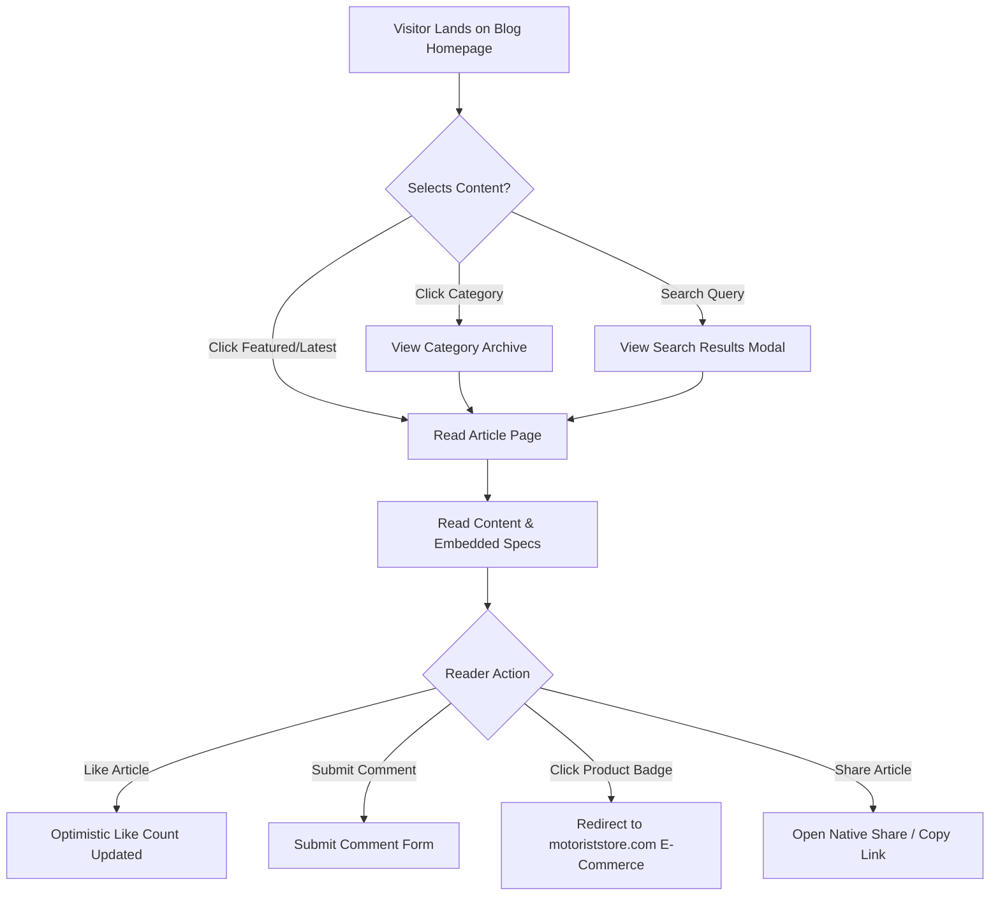
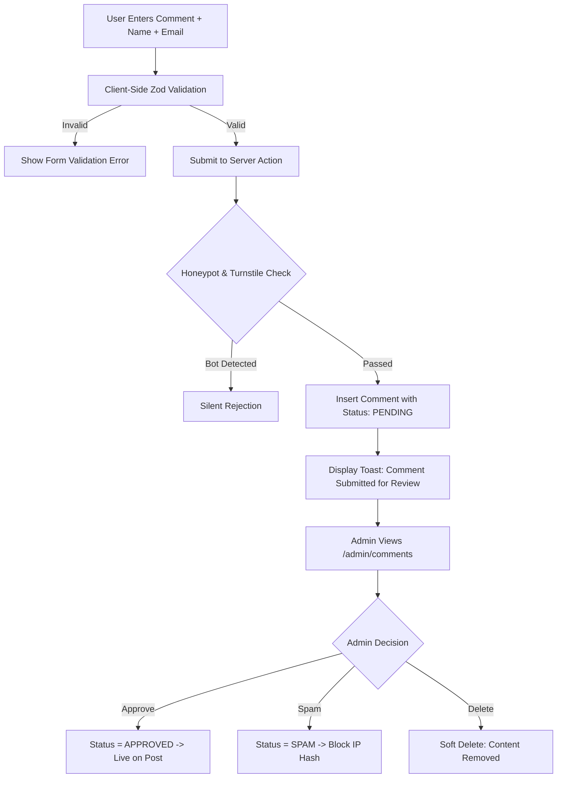
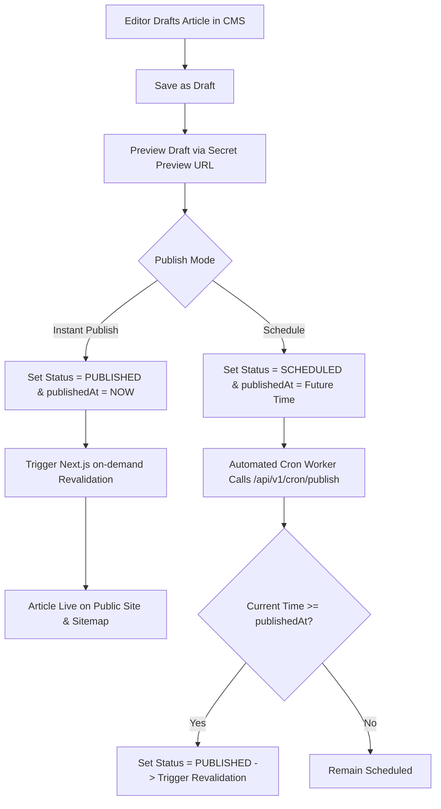
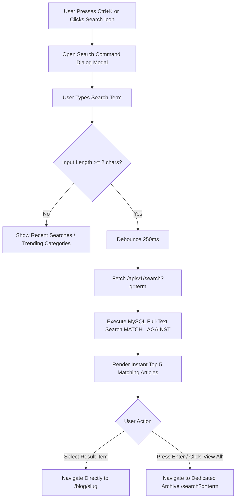
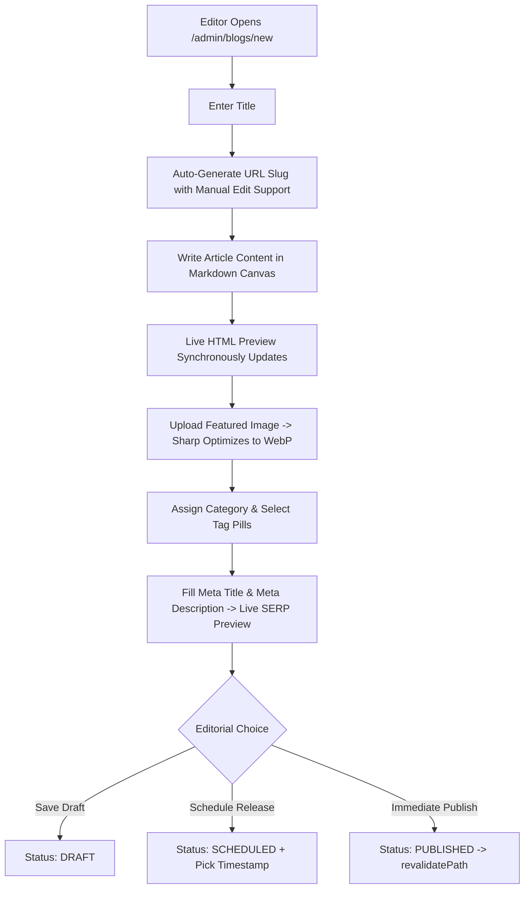

# Product Requirements Document (PRD)
## MOTORIST Blog + Content Management System (CMS)

---

### Document Control
- **Document Version:** 1.1.0
- **Status:** Approved / Phase 1 Complete
- **Product Name:** MOTORIST Blog + CMS
- **Primary Brand Reference:** [MOTORIST Store](https://motoriststore.com/)
- **Target Launch:** Q4 2026
- **Lead Architect:** Antigravity AI (Lead Product Architect & Senior Software Engineer)

---

## 1. Project Overview

### 1.1 Executive Summary
MOTORIST is a premier performance motorcycle accessories and lifestyle brand specializing in enthusiast hardware—including custom exhausts (Akrapovic, Yoshimura, SC Project), crash protection, mudguards, touring gear (Himalayan 450, Duke 390 Gen-3, XPulse 210, Royal Enfield), and cutting-edge LED lighting systems. 

The **MOTORIST Blog + CMS** project is an editorial and content management platform built to establish MOTORIST as the definitive voice in motorcycle mechanics, riding culture, DIY installations, and bike modifications. By providing in-depth build breakdowns, maintenance tutorials, gear roundups, and route guides, the blog serves as an organic acquisition engine and brand trust builder that seamlessly funnels high-intent motorcycle riders into the e-commerce store (`motoriststore.com`).

### 1.2 Vision Statement
To build a lightning-fast, visually captivating, and community-engaging editorial ecosystem that reflects the industrial grit, precision engineering, and premium aesthetic of the MOTORIST brand while maintaining an intuitive, friction-free publishing experience for content editors.

---

## 2. Project Objectives & Business Goals

### 2.1 Project Objectives
1. **Brand Authority:** Establish MOTORIST as an authority on motorcycle tuning, parts compatibility, touring setups, and track performance.
2. **Organic Discovery (SEO):** Capture long-tail search traffic across automotive queries (e.g., "Himalayan 450 exhaust install", "Duke 390 tail tidy guide", "best LED headlights for Royal Enfield").
3. **E-Commerce Synergy:** Bridge editorial content with e-commerce products through contextual product badges, build checklists, and direct-to-cart CTAs.
4. **Reader Engagement:** Foster an active rider community via interactive likes, threaded discussions, social sharing, and curated tag navigation.
5. **Operational Autonomy:** Empower the internal editorial team to draft, schedule, optimize, and publish multimedia articles without engineering intervention.

### 2.2 Key Performance Indicators (KPIs) & Business Goals
- **Organic Traffic:** 50,000+ monthly unique organic visitors within 6 months post-launch.
- **Dwell Time:** Average time on page > 3 minutes for long-form guide articles.
- **Conversion / Click-Through Rate (CTR):** > 8% CTR from article product callouts to `motoriststore.com` product pages.
- **Engagement Rate:** > 4% reader engagement (measured as Like, Share, or Comment per 100 reads).
- **Core Web Vitals:** Maintain 95+ Mobile and Desktop Google Lighthouse scores (LCP < 2.0s, CLS < 0.05, INP < 150ms).

---

## 3. Target User Personas

### 3.1 Public User Personas

#### Persona 1: "The DIY Performance Modder" (Arjun, 27)
- **Profile:** Software engineer by day, amateur mechanic on weekends. Owns a KTM Duke 390 Gen-3.
- **Motivations:** Wants deep technical guides, dyno results, exhaust sound tests, and bolt-on installation tutorials.
- **Pain Points:** Frustrated by low-effort, AI-generated generic car/bike content; wants exact bolt torque specs, bracket fitments, and honest audio clips.
- **Platform Usage:** Mobile-first, searches via Google while working in the garage, shares guides on WhatsApp riding groups.

#### Persona 2: "The Long-Distance Tourer" (Vikram, 36)
- **Profile:** Rides a Royal Enfield Himalayan 450 on cross-country expeditions (Ladakh, Spiti, Western Ghats).
- **Motivations:** Needs rugged reliability, crash guard reviews, waterproof luggage racks, auxiliary LED headlight wiring, and route recommendations.
- **Pain Points:** Needs mobile-friendly, fast-loading guides when on patchy mobile networks during trips; values real-world durability over marketing hype.
- **Platform Usage:** Uses tablet and mobile; frequently comments to ask about luggage load capacity and rainy season weatherproofing.

#### Persona 3: "The Daily Commuter & Aesthetic Upgrader" (Karan, 22)
- **Profile:** College student/junior professional riding a Hero XPulse 210 or Hunter 350 in urban traffic.
- **Motivations:** Seeks affordable aesthetic enhancements (tail tidies, bar-end mirrors, LED indicators, slip-on exhausts).
- **Pain Points:** Budget-conscious; terrified of purchasing incompatible parts or failing local traffic inspections.
- **Platform Usage:** Discovers posts via social media links (Instagram/X); quick scan of summary, reading time, and direct pricing links.

### 3.2 Administrative Personas

#### Admin Persona: "The Editorial Manager / Content Lead" (Priya, 31)
- **Profile:** Manages MOTORIST's content calendar, social presence, and e-commerce marketing campaigns.
- **Motivations:** Needs an effortless CMS with live preview, Markdown/WYSIWYG support, instant SEO audits, drag-and-drop media uploading, and comment moderation.
- **Pain Points:** Struggles with clunky legacy CMSs (WordPress plugins breaking, slow page builders, messy formatting).
- **Platform Usage:** Desktop browser (Chrome on MacBook/PC); requires fast bulk actions and schedule publishing.

---

## 4. Product Scope: MVP vs. Future Scope

| Feature Area | MVP (Phase 1–6) | Future Scope (Post-Launch) |
|---|---|---|
| **Public Blog** | Responsive homepage, category/tag archives, article detail page, search, likes, comments, social sharing. | Personalized article feed, reader bookmarks, dark/light theme switch persistence across subdomains. |
| **Comments & Discussions** | Guest comments (name, email, text), 1-level nested replies, 100% pre-moderation queue, honeypot + Cloudflare Turnstile spam protection. | User social login (Google/Shopify Account), email notification on reply, **Comment Liking (`CommentLike` upvoting)**. |
| **Article Engagement** | Blog-level likes (`BlogLike`) with optimistic UI and IP+UA salt hashing, native Web Share API & fallback share drawer. | Audio narration (text-to-speech), user bookmarking, reader emoji reactions (fire, wrench, applause). |
| **Admin CMS** | Password-protected admin portal, single `ADMIN` capability tier (with RBAC-ready schema), rich post editor, category/tag CRUD, media manager, comment moderation. | Multi-tier RBAC (`SUPER_ADMIN`, `EDITOR`, `AUTHOR`), activity audit logs, automated scheduled database backups. |
| **Store Integration** | Manual product embed cards with custom image, link, and price CTA to `motoriststore.com`. | Direct Shopify Storefront API integration for live stock status, real-time pricing, and 1-click add-to-cart. |
| **SEO & Discovery** | Dynamic XML sitemap, RSS feed, schema.org JSON-LD (Article, Breadcrumbs, Organization), Open Graph, canonical tags. | Automated broken link checker, Google Indexing API webhook on publish, automated newsletter dispatch. |

> **Scope Note on Comment Liking (`CommentLike`):** Liking/upvoting individual comments is explicitly deferred to **Future Scope**. MVP focuses exclusively on article-level likes (`BlogLike`) to preserve clean mobile layouts and avoid unnecessary database mutation load.

---

## 5. Public Website Features & Requirements

### 5.1 Homepage (`/`)
- **Hero Section:** Prominently highlights 1 top-tier "Featured Story" with high-resolution imagery, category badge, publication date, reading time, and teaser excerpt.
- **Editorial Sub-Featured Grid:** 2 to 3 curated trending stories directly below or adjacent to the hero.
- **Latest Stories Stream:** Chronological feed of published articles with infinite scroll or numeric pagination.
- **Category Filter Tabs:** Fast client-side/URL-synced category switcher (`All`, `Performance Mods`, `Bike Builds`, `Maintenance`, `Touring & Gear`).
- **Brand Continuity Bar:** A high-impact banner bridging the blog with the store: *"Need Performance Upgrades? Explore the MOTORIST Catalog"* linking to `https://motoriststore.com/`.
- **Newsletter Subscription Card:** Clean input to capture subscriber emails for weekly garage dispatches.

### 5.2 Blog Listing & Archive Pages (`/category/[slug]`, `/tag/[slug]`, `/blog`)
- **Header Banner:** Category or tag title, description, and article count.
- **Sort & Filter Controls:** Sort by: `Latest`, `Oldest`, `Most Liked`.
- **Grid Layout:** Responsive 3-column desktop / 2-column tablet / 1-column mobile card grid.
- **Article Card Elements:**
  - Aspect ratio 16:9 featured thumbnail with subtle zoom on hover.
  - Category pill badge (rounded-full / 40px radius matching MOTORIST design system).
  - Article headline (clamp 2 lines).
  - Excerpt (clamp 3 lines).
  - Metadata row: Author avatar + name, publication date, reading time estimate, like count.
- **Pagination:** Clean numeric pagination with `Previous` and `Next` controls.

### 5.3 Individual Blog Post Page (`/blog/[slug]`)
- **Breadcrumbs:** `Home > Blog > [Category] > [Article Title]` (Schema.org compliant).
- **Article Header:**
  - Primary Category badge.
  - Article `h1` Title (bold, high-contrast, optimized typography).
  - Subtitle / Article Excerpt.
  - Author meta bar: Author avatar, author name (clickable to author bio), published date, last updated date (if modified), estimated reading time.
  - Engagement counters: Real-time like counter, comment counter, share button.
- **Featured Media:** Full-width or boxed responsive hero image with photo credit / caption support.
- **Table of Contents (TOC):**
  - Sticky sidebar on desktop (> 1024px) auto-generated from `h2` and `h3` tags.
  - Collapsible drawer on mobile devices.
- **Article Body:**
  - Rich typography formatted with generous line-height (`1.75`) and max reading width (`720px - 780px`).
  - Styled callout blocks (`Warning`, `Pro Tip`, `Spec Check`, `Fitment Note`).
  - Embedded YouTube / Vimeo video player with lazy loading.
  - High-res image comparison slider or lightbox-enabled image galleries.
  - **MOTORIST Product Callout Card:** Distinct custom block embedding products from `motoriststore.com` (image, title, compatibility tag, price, and "Shop Part" button).
- **Tag Cloud:** List of clickable tags associated with the post.
- **Social Sharing Bar:** Floating vertical bar on desktop; fixed bottom pill or inline bar on mobile. Channels: WhatsApp, X (Twitter), Facebook, LinkedIn, Copy Link.
- **Author Bio Card:** Detailed author avatar, bio, specialization (e.g., "KTM Track Specialist"), and links to author's social channels.
- **Related Articles:** Curated 3-article grid matching current category and tags.

### 5.4 Blog Like System
- **Public Action:** Any visitor can click the Like button (heart/flame icon).
- **Interaction Feedback:** Instant optimistic UI increment, micro-animation (pop/scale bounce), active color fill.
- **Duplicate Prevention (Approved Strategy):** Public likes are throttled using an anonymous composite SHA-256 fingerprint:
  $$\text{identifierHash} = \text{SHA-256}(\text{Client IP} + \text{User-Agent} + \text{SERVER\_SALT})$$
  stored in the `BlogLike` table (`@@unique([blogId, identifierHash])`) paired with a persistent `localStorage` key on the client.
- **Unlike Support:** If clicked a second time within the active session, decrement count, remove `BlogLike` record, and sync client state.

### 5.5 Comment System & Moderation
- **Comment Tree Hierarchy:** 2-tier depth (Root comment -> 1-level nested replies). Prevents infinite nesting UI degradation on mobile screens.
- **Guest Comment Form:**
  - Fields: Full Name (required), Email Address (required, never displayed publicly), Website URL (optional), Comment text (required, 10–1000 characters).
  - Honeypot hidden input to trap naive spambots.
  - Cloudflare Turnstile invisible challenge widget.
- **Moderation Workflow (Approved Strategy):** **100% Pre-Moderation**. All guest comments are inserted with `status: PENDING` and require explicit Admin approval before appearing on the public blog post.
- **Reply Action:** Clicking "Reply" opens an inline nested response form referencing the parent comment ID.
- **Reporting / Flagging:** Users can flag inappropriate comments, incrementing an `isFlagged` counter visible in the Admin CMS.

### 5.6 Search System (`/search`)
- **Instant Search Bar:** Accessible in the global header modal via `Ctrl+K` / `Cmd+K` keyboard shortcut or clicking the search icon.
- **Query Processing:** Debounced (250ms) full-text query matching article titles, excerpts, body content, categories, and tags using MySQL Native Full-Text Search.
- **Search Results Page:** Dedicated URL `/search?q=himalayan` displaying matching articles with highlighted snippets and facet filters.

---

## 6. Admin CMS Requirements

### 6.1 Admin Authentication & Access
- Dedicated URL path (`/admin/login`).
- Secure credential authentication (email & password with Argon2id hashing).
- Session management via HttpOnly, Secure, SameSite=Lax cookies containing an encrypted JWT.
- Brute-force protection: IP lockout after 5 consecutive failed attempts.
- **Role Tier (Approved Strategy):** Single `ADMIN` privilege capability for MVP (all authenticated staff have full access), while the underlying database schema retains the `Role` enum (`SUPER_ADMIN`, `EDITOR`, `AUTHOR`) for zero-migration RBAC expansion.

### 6.2 Admin Dashboard (`/admin`)
- Metric summary tiles: Total Published Articles, Draft & Scheduled Articles, Pending Comments awaiting moderation, Total Blog Likes, 30-Day Top Performing Articles.
- Quick Action shortcuts: `New Article`, `Moderate Comments`, `Media Library`.

### 6.3 Blog Post Management (`/admin/blogs`)
- **List View:** Data table with sorting, search, and status filter tabs (`All`, `Published`, `Draft`, `Scheduled`, `Archived`). Columns: Title, Category, Author, Status Badge, Published Date, Likes, Comments, Actions (`Edit`, `Preview`, `Delete`).
- **Post Editor (`/admin/blogs/new` & `/admin/blogs/[id]`):**
  - Two-column layout: Main Content Canvas (left 70%), Publishing & Metadata Sidebar (right 30%).
  - Content Editor: Markdown editor with side-by-side live preview.
  - Title & URL Slug: Auto-generated slug from title with manual override and uniqueness validation.
  - Excerpt: Plain text summary (recommended 140–160 characters; database capacity 500 characters).
  - Category selector (single primary category) and Tag selector (multi-select tag pills).
  - Featured Image uploader with preview, focal point selection, and alt-text field.
  - Featured Post toggle (`isFeatured: boolean`).
  - Publishing Status: `DRAFT`, `PUBLISHED`, `SCHEDULED`, `ARCHIVED`.

### 6.4 Category & Tag Management (`/admin/categories`, `/admin/tags`)
- Create, edit, and delete categories (Name, Slug, Description, Hero Banner Image).
- Create, edit, and delete tags (Name, Slug).
- Prevent deletion of categories that have active assigned posts (require re-assignment).
- Tag usage counter display.

### 6.5 Media Management (`/admin/media`)
- Drag-and-drop file uploader supporting PNG, JPEG, WebP, AVIF, and GIF.
- Automated client/server-side image compression and conversion to WebP/AVIF via `sharp`.
- **Storage Strategy (Approved):** Local filesystem (`/public/uploads`) during local development; Cloudflare R2 (S3-compatible, zero egress fees) in production.
- Media grid view with search by filename, copy URL button, image dimensions, and file size.
- Delete media with confirmation dialog.

### 6.6 Comment Moderation Queue (`/admin/comments`)
- Moderation tabs: `Pending Approval`, `Approved`, `Flagged / Spam`, `Trash`.
- Bulk actions: `Approve Selected`, `Mark as Spam`, `Delete`.
- Inline view of commenter name, email, IP hash, target blog post, submission timestamp, and comment text.

### 6.7 SEO Management & Controls (Per Post & Global)
- **Per-Post SEO Controls:** Meta Title, Meta Description, Canonical URL, Open Graph (OG) Image override, Twitter Card type (`summary_large_image`), Robots meta directives (index/noindex, follow/nofollow toggles), Live Google SERP and Social Card previews.
- **Global SEO Controls:** Auto-generated dynamic `sitemap.xml`, dynamic `robots.txt`, and Schema.org JSON-LD structured data.

---

## 7. User & Admin Process Flows

### 7.1 Reader Discovery Flow


### 7.2 Comment Submission & Moderation Flow


### 7.3 Publishing & Scheduling Flow


### 7.4 Like / Unlike Flow (Optimistic UI with Rollback)
```mermaid
flowchart TD
    A[User Clicks Like Button] --> B{Already Liked in localStorage?}
    B -->|No| C[Optimistic UI: Increment Counter + Heart Animation]
    B -->|Yes| D[Optimistic UI: Decrement Counter + Remove Fill]
    C --> E[Call toggleLikeAction with blogId]
    D --> E
    E --> F[Compute SHA-256 of IP + UA + Server Salt]
    F --> G{Record Exists in BlogLike?}
    G -->|No (Like)| H[Insert BlogLike & Increment blog.likeCount]
    G -->|Yes (Unlike)| I[Delete BlogLike & Decrement blog.likeCount]
    H --> J[Return Success -> Update localStorage]
    I --> J
    E -->|Network Failure / 429 Rate Limit| K[Revert Optimistic UI & Show Toast Error]
```

### 7.5 Search Flow (Instant Command Dialog & Full Archive)


### 7.6 Admin Post Authoring, Preview & Lifecycle Flow


---

## 8. System Edge Cases & Failure Modes Matrix

| Failure Mode / Edge Case | Triggering Condition | Architectural & UX Mitigation |
|---|---|---|
| **1. Slug Collision** | Editor creates an article with a title that generates an existing URL slug. | Server Action runs `slugify()` and checks database. If conflict exists, appends unique timestamp/short hash (e.g. `duke-390-exhaust-2`) and displays warning badge. |
| **2. Concurrent Likes Spike** | Viral post receives hundreds of simultaneous like clicks within a single second. | Atomic Prisma increment `likeCount: { increment: 1 }` wrapped in transaction. `identifierHash` unique constraint rejects duplicate votes cleanly. |
| **3. Scheduled Post Clock Skew** | Scheduled release timestamp occurs between 5-minute cron execution intervals. | Public query filters by `publishedAt: { lte: new Date() }` as a secondary safety guard so overdue posts appear to readers even if cron is delayed by 1–2 minutes. |
| **4. Comment Spam Flood** | Automated bot farm attempts hundreds of comment submissions. | Multi-tier defense: 1) Invisible honeypot field traps naive bots; 2) Cloudflare Turnstile stops automated headless browsers; 3) IP sliding-window rate limit (max 5 per 5 mins). |
| **5. Deleting Assigned Category** | Admin attempts to delete a category that contains 15 published articles. | Database enforces `onDelete: Restrict`. CMS UI disables delete button and displays alert: *"Category contains 15 articles. Reassign them before deleting."* |
| **6. Threaded Comment Deletion** | Admin removes a root comment that has approved nested replies. | Soft-delete applied: Content is replaced with `"[This comment was removed by moderator]"`, preserving the nested discussion tree structure. |
| **7. Large / Malicious Media Upload** | User uploads 25MB file or renames `.exe` to `.png`. | Magic-byte signature sniffing via `file-type` checks actual binary payload. File size capped at 5MB. Sharp rejects invalid image buffers before storage. |
| **8. Mobile Offline / Weak Signal** | Reader on highway loses internet connection while clicking Like or reading. | Optimistic UI responds instantly. If network request fails, state reverts smoothly with an amber toast: *"Offline. Your like could not be saved."* |

---

## 9. Non-Functional Requirements

### 9.1 Performance Requirements
- **Lighthouse Performance Score:** $\ge 95$ on desktop, $\ge 90$ on mobile.
- **Largest Contentful Paint (LCP):** $< 2.0$ seconds on 4G connections.
- **Cumulative Layout Shift (CLS):** $< 0.05$.
- **First Input Delay (FID) / Interaction to Next Paint (INP):** $< 150$ milliseconds.
- **Image Optimization:** All uploaded images automatically served in next-gen formats (`.webp`, `.avif`) using Next.js Image optimization with responsive `srcset` and blur placeholder data URLs.

### 9.2 Accessibility Requirements (a11y)
- Full compliance with **WCAG 2.1 Level AA**.
- Minimum color contrast ratio of $4.5:1$ for regular text and $3:1$ for large text and UI components.
- Complete keyboard accessibility: Focus rings visible on all interactive elements, logical tab indexing, `Skip to Content` link.
- Descriptive ARIA attributes on modals, drawers, like buttons, and comment accordions.

### 9.3 Responsive Requirements
- Fully responsive across all viewport breakpoints:
  - Mobile Small: 360px – 480px
  - Mobile Large / Phablet: 481px – 767px
  - Tablet: 768px – 1023px
  - Desktop Standard: 1024px – 1439px
  - Large Desktop / Ultrawide: 1440px – 2560px
- Zero horizontal overflow on any device. Touch targets $\ge 44 \times 44$ px on touch interfaces.

### 9.4 Security Requirements
- **Input Sanitization:** Strict DOMPurify sanitization on rendered HTML/Markdown to eliminate Cross-Site Scripting (XSS).
- **SQL Injection Defense:** All database interactions strictly mediated through Prisma ORM parameterized queries.
- **CSRF Protection:** State-changing Server Actions and API endpoints protected via Next.js same-origin headers and anti-CSRF token verification.
- **Rate Limiting:** IP-based sliding window rate limiting on comment submissions (max 5 per 5 minutes per IP) and like actions (max 30 per minute per IP).
- **Authentication Security:** Admin passwords hashed using Argon2id with minimum 12-round salt. Secure, HttpOnly, SameSite=Lax session cookies.
- **Content Security Policy (CSP):** Strict CSP headers restricting script, style, and iframe sources.

---

## 10. Approved Decisions Record

All architectural decisions have been formally approved by project leadership:

1. **Comment Moderation Policy:** **APPROVED — Option A (100% Pre-Moderation)**. All public comments default to `PENDING` and require admin review before publication.
2. **Spam Defense:** **APPROVED — Option A (Cloudflare Turnstile + Honeypot)**. Frictionless verification for real users with robust bot blocking.
3. **Media Storage Backend:** **APPROVED — Option A (Local disk for development; Cloudflare R2 for production)**. Eliminates egress bandwidth costs while ensuring serverless scalability.
4. **Anonymous Like Tracking:** **APPROVED — Option A (Composite SHA-256 Hash + localStorage)**. Enforces uniqueness without storing raw IP PII.
5. **Comment Liking Scope:** **APPROVED — Option B (Deferred to Future Scope)**. MVP focuses exclusively on article-level likes (`BlogLike`).
6. **Admin Role Capability:** **APPROVED — Option A (Single Admin tier for MVP)**. All authenticated staff hold full editorial capabilities; database schema retains the `Role` enum for zero-migration RBAC expansion.
